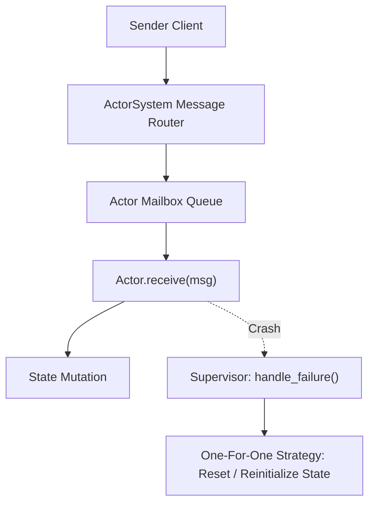

# genpark-actor-model-supervision-tree-skill

Agent Skill implementing an **Erlang/OTP-Style Actor Model & Supervision Tree** with isolated actor mailboxes, nonblocking message passing, and supervisor failure recovery.

## Architectural Overview

